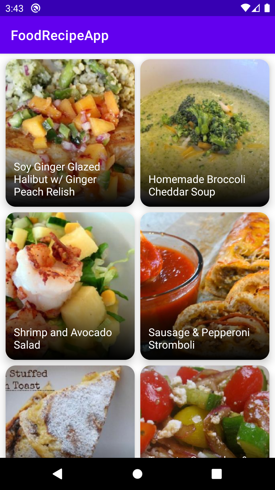

# Food Recipe App
Food Recipe App is the perfect solution for foodies who are bored of the cooking the same food everyday. It is an android application that offers different recipes using <a href=https://spoonacular.com/food-api>Spoonacular API</a>.  
With Food Recipe App, users can see a random recipes and they can  search recipes by keyword search and more .

### IN-PROGRESS
* Recipe Details Page
* gSearch Bar

### Features
* Random recipes available for the day
* Search by keyword ( e.g. "Pasta")

### Tech Stack
* Kotlin
* Jetpack Compose 
* Android Studio (Version - Arctic Fox)
* Spoonacular API
* MVVM
* Mutable State
* Navigation Component   
* Hilt
* Clean Architecture
* Retrofit2 

### References 

* Compose Samples - https://github.com/android/compose-samples
* Jetpack Compose - https://developer.android.com/jetpack/compose
* State in Compose - https://developer.android.com/jetpack/compose/state
* Hilt - https://developer.android.com/training/dependency-injection/hilt-jetpack

